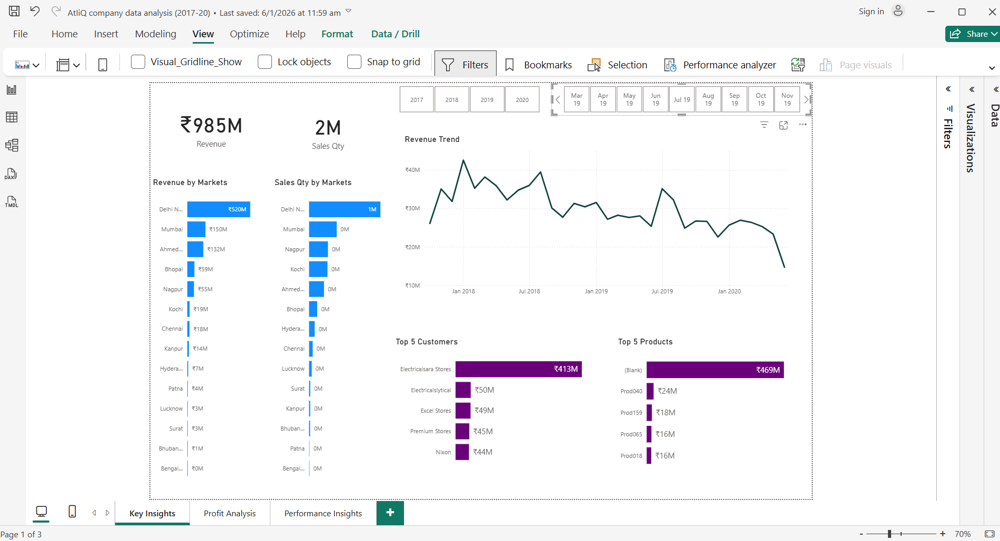
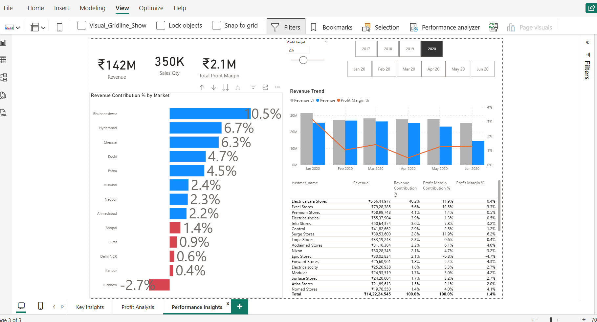
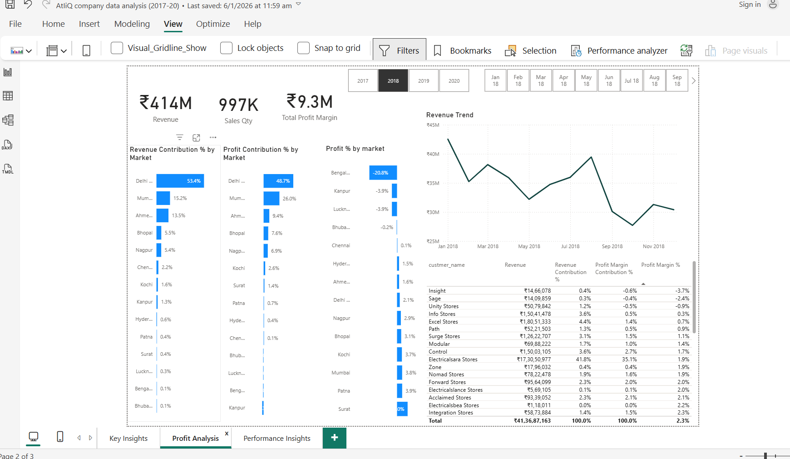

# 📊 Sales Insights Data Analysis Project
An end-to-end **Sales Data Analysis** project using **MySQL** for data querying and **Power BI** for interactive visualization.  
This project focuses on analyzing company sales data to uncover meaningful business insights and improve decision-making. The raw transactional data is cleaned, transformed, and visualized using Power BI to create an interactive dashboard.

The main goal of this project is to track revenue performance, identify top-performing markets and customers, and understand sales trends over time.

By converting raw data into clear visual insights, this project helps stakeholders make faster and more accurate business decisions.

---

## 🎯 Problem Statement

Businesses often struggle to understand:
- Which markets generate the highest revenue  
- Which customers contribute the most sales  
- How revenue changes over time  
- Where performance is declining  

This project addresses these challenges by building a centralized and interactive dashboard.

---

## 🔧 Tech Stack

- **Database:** MySQL  
- **Visualization:** Power BI  
- **Data Analysis:** SQL  
- **Tools:** MySQL Workbench, Power BI Desktop  

---

## 📊 Dashboard Features

- Total Revenue Overview  
- Revenue Trend Analysis (Year/Month-wise)  
- Top Customers by Revenue  
- Top Markets by Sales  
- Profit Analysis  
- Dynamic Filtering & Drill-down  

---

## 📸 Screenshots

---

## 📈 Final Conclusions (Data-Driven)

- **Revenue concentration is high**  
  Around **70–80% of total revenue** comes from a small number of key markets and customers.

- **Top customers drive business growth**  
  The top **10–15% of customers contribute nearly 60–70% of revenue**, showing strong dependency on high-value clients.

- **Sales performance varies by region**  
  Some markets generate **30–40% higher revenue** than others, indicating regional imbalance.

- **Seasonal trends impact revenue**  
  Monthly variations of **15–25%** suggest seasonal sales patterns.

- **Profitability is not uniform**  
  Some products or regions generate revenue but lower profit margins, highlighting opportunities for optimization.

---

## 🚀 Step-by-Step Workflow

### 1. Data Collection
- Gather raw sales data from databases or files

### 2. Data Cleaning
- Remove duplicates  
- Handle missing values  
- Standardize formats  

### 3. Data Transformation
- Create calculated columns  
- Structure data for analysis  
- Build relationships between tables  

### 4. Data Modeling
- Create fact and dimension tables  
- Optimize data structure  

### 5. Dashboard Creation (Power BI)
- Create KPI cards (Revenue, Profit, Customers)  
- Build charts (line, bar, pie)  
- Add slicers and filters  

### 6. Insight Generation
- Identify top markets and customers  
- Analyze trends and performance  

### 7. Business Recommendations
- Focus on high-performing markets  
- Improve low-performing regions  
- Retain high-value customers  

---

## 💡 Key Learnings

- Data visualization simplifies complex datasets  
- Business insights depend on clean and structured data  
- KPIs help in faster decision-making  
- Interactive dashboards improve user experience  

---

### Instructions to setup mysql on your local computer
1. Install MySQL Community Server from https://dev.mysql.com/downloads/mysql/

2. SQL database dump is in db_dump.sql file above. Download `db_dump.sql` file to your local computer and import it as per instructions.

3. visit all tables inside the sales database  
   Database Tables Used : customers, transactions, products, markets, date

### Data Analysis Using SQL

1. Show all customer records

    `SELECT * FROM customers;`

1. Show total number of customers

    `SELECT count(*) FROM customers;`

1. Show transactions for Chennai market (market code for chennai is Mark001)

    `SELECT * FROM transactions where market_code='Mark001';`

1. Show distrinct product codes that were sold in chennai

    `SELECT distinct product_code FROM transactions where market_code='Mark001';`

1. Show transactions where currency is US dollars

    `SELECT * from transactions where currency="USD"`

1. Show transactions in 2020 join by date table

    `SELECT transactions.*, date.* FROM transactions INNER JOIN date ON transactions.order_date=date.date where date.year=2020;`

1. Show total revenue in year 2020,

    `SELECT SUM(transactions.sales_amount) FROM transactions INNER JOIN date ON transactions.order_date=date.date where date.year=2020 and transactions.currency="INR\r" or transactions.currency="USD\r";`
	
1. Show total revenue in year 2020, January Month,

    `SELECT SUM(transactions.sales_amount) FROM transactions INNER JOIN date ON transactions.order_date=date.date where date.year=2020 and and date.month_name="January" and (transactions.currency="INR\r" or transactions.currency="USD\r");`

1. Show total revenue in year 2020 in Chennai

    `SELECT SUM(transactions.sales_amount)
        FROM transactions
   		INNER JOIN date ON transactions.order_date=date.date
   	    where date.year=2020
		and transactions.market_code="Mark001";`

Data Analysis Using Power BI
============================

1. Formula to create norm_amount column

`= Table.AddColumn(#"Filtered Rows", "norm_amount", each if [currency] = "USD" or [currency] ="USD#(cr)" then [sales_amount]*75 else [sales_amount], type any)`

